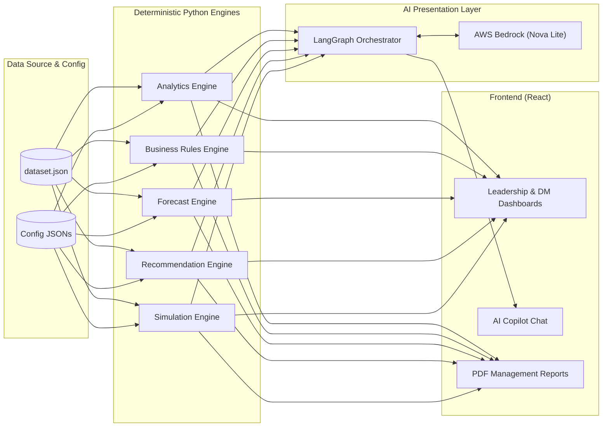
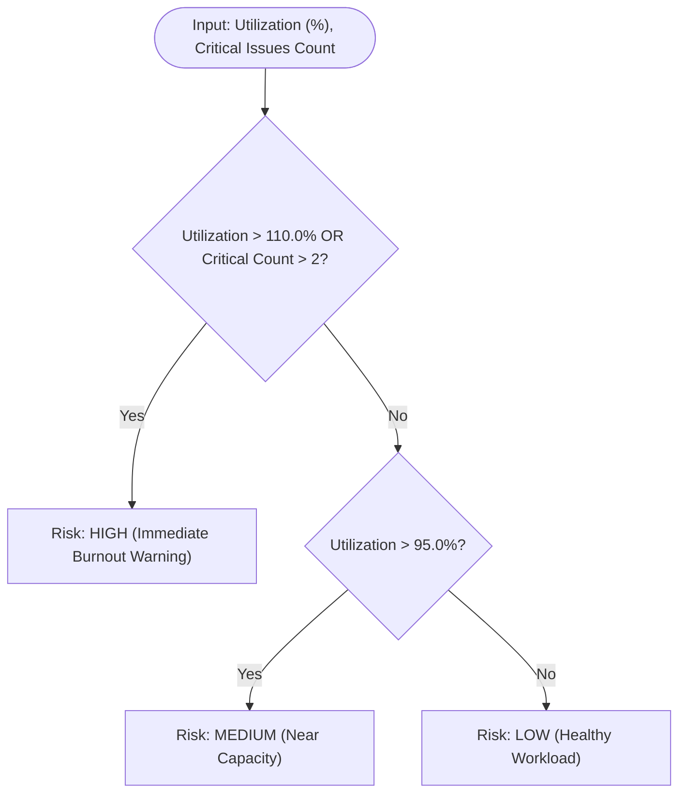
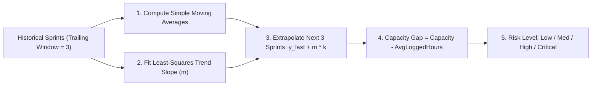

# CUIA — Capacity & Utilization Intelligence Agent: Comprehensive Project Analysis

---

## 1. What is this Project?

**CUIA (Capacity & Utilization Intelligence Agent)** is an enterprise workforce analytics and engineering intelligence platform. It aggregates simulated project tracking data (Jira-style issues, sprint logs, engineer capacities, and organizational hierarchies) to provide real-time, 100% deterministic visibility into engineering capacity, workload distribution, team health, and delivery risks.

The system combines:
1. **Deterministic Analytics Core (Python/FastAPI):** A computation engine where all business rules, aggregations, trend extrapolations, simulations, and risk scorings are calculated with mathematical precision.
2. **AI Copilot Presentation Layer (LangGraph + AWS Bedrock):** A natural language interface that **never computes metrics on its own**, but instead queries, summarizes, and explains the deterministic results produced by the backend.
3. **Interactive Web Application (React + Vite + Tailwind CSS):** Role-based dashboards for Delivery Managers and Executive Leadership with interactive gauges, charts, tables, and PDF reporting.



---

## 2. Why is it Needed? (The Business Problem)

In modern software engineering organizations, tracking developer capacity, team throughput, and burnout is typically done through manual spreadsheets, fragmented Jira JQL filters, and subjective status updates.

| Traditional Manual Approach | The CUIA Solution |
| :--- | :--- |
| **Reactive & Delayed:** Burnout, overloading, or capacity shortfalls are noticed only after sprint deadlines are missed. | **Real-Time & Proactive:** Continuous tracking of utilization, estimation accuracy, and blockers flags risks as they develop. |
| **Subjective & Inconsistent:** Different managers define "capacity" and "health" differently across teams. | **Deterministic & Standardized:** Configurable business rules compute uniform health scores, utilization rates, and risk indices across all teams. |
| **Time-Consuming Cross-Referencing:** Answering questions like *"Why is Team Alpha falling behind?"* requires hours of digging through tickets and logs. | **Instant Natural Language Copilot:** Managers can query the Copilot in plain English and receive scoped, mathematically validated root-cause explanations. |
| **Opaque Skill Dependencies:** Knowledge silos (Single Points of Failure) remain hidden until a key engineer goes on leave. | **Automated SPOF Detection:** Analyzes primary/secondary skills to detect single points of failure and suggests cross-training candidates. |

---

## 3. What are We Expecting as Output?

CUIA produces 5 distinct categories of outputs:

### 1. Interactive Role-Based Web Dashboards
- **Leadership Dashboard (`LeadershipDashboard.tsx`):** Org-wide KPIs (overall utilization, total capacity vs. logged hours, team health averages, active blockers, critical issue counts, high burnout alerts).
- **Delivery Manager (DM) Dashboard (`DeliveryDashboard.tsx`):** Scoped drilldowns into the specific teams and engineers managed by that DM.
- **Team & Engineer Detail Views (`TeamDetails.tsx`, `EngineerDetails.tsx`):** Individual utilization breakdowns, story point velocity, estimation error tracking, and skills inventory.

### 2. Natural Language AI Copilot Insights
- Context-aware answers via `Copilot.tsx` and `graph.py`.
- Example outputs: Explanations of why a team's health dropped, ranked lists of top performers or overloaded engineers, and follow-up conversational memory ("Why is that?").

### 3. Actionable Rule-Based Recommendations
- Generated deterministically by `recommendation_engine.py` using `recommendation_rules.json`.
- Each recommendation includes: **Severity**, **Business Rule**, **Reason**, **Business Impact**, **Supporting Metrics**, **Suggested Action**, and **Expected Outcome**.

### 4. What-If Scenario Simulations
- Evaluated on demand by `simulation_engine.py`.
- Allows managers to simulate:
  - Engineer taking leave or departing the company.
  - Reallocating tickets between engineers.
  - Adding/removing sprint tickets.
  - Team restructuring or merging.
- **Output:** A deterministic `before`, `after`, and `delta` differential comparison showing the exact net impact on team health, utilization, and capacity.

### 5. Forward-Looking Capacity Forecasts & PDF Reports
- **Forecast Output (`forecast_engine.py`):** 3-sprint forward projections of capacity, demand, moving average velocity, and risk ratings.
- **Automated PDF Reports (`report_engine.py`):**
  - **Daily Report:** Today's utilization, remaining sprint hours, active blockers, and urgent recommendations.
  - **Weekly Report:** Sprint execution summary, team comparison matrix, velocity vs. capacity demand.
  - **Monthly Report:** Executive summary, organizational health trends, prolonged burnout alerts, and strategic staffing recommendations.

---

## 4. Significance & Core Architectural Innovations

### A. The "Deterministic-First" AI Philosophy (Zero Hallucinations)
A major risk in enterprise analytics is LLMs inventing numbers, miscalculating averages, or hallucinating explanations. CUIA strictly decouples **computation** from **presentation**:
- **Python does 100% of the math:** All aggregations, weights, rankings, and forecasts are calculated deterministically by Python services.
- **The LLM is only an explainer:** The model receives pre-computed numbers in a minimal JSON payload and is constrained by system prompts to strictly describe the provided numbers without inventing or computing anything.

### B. Two-Tier Zero-Cost Intent & Entity Routing
Instead of sending every raw user query to a heavy LLM, CUIA uses a fast, local pipeline (`intent_classifier.py`, `entity_extractor.py`):
- Keyword & entity matching classifies ~90% of user queries with **0 LLM calls**.
- Malicious prompt injections (e.g., "ignore previous instructions", "dump database") and out-of-scope queries (weather, recipes) are terminated instantly at the entry node without incurring LLM token costs.

### C. Strict Persona & Data Isolation (Row-Level Security)
- Configured in `context_builders.py` and `dashboard.py`.
- A Delivery Manager (e.g., `dm-1`) can only query and view teams/engineers assigned under their manager ID.
- Even if a DM attempts prompt injection to ask about another manager's team, the context builder passes an empty dataset, preventing cross-tenant data leakage.

---

## 5. Summary Table of All Metrics

| Metric Name | Scope | Configuration Source | Primary Purpose |
| :--- | :--- | :--- | :--- |
| **Effective Capacity** | Engineer | `dataset.json` | Baseline workable hours per week excluding meetings/training |
| **Sprint Capacity** | Engineer / Team / Org | `analytics_rules.json` | Total available hours across the sprint window |
| **Utilization Rate (%)** | Engineer / Team / Org | `analytics_rules.json` | Identifies underutilized vs. overloaded capacity |
| **Productivity Score** | Engineer / Team / Org | `priority_weights.json` | Values delivered high-priority work over raw ticket counts |
| **Velocity (Story Points)** | Engineer / Team / Org | `analytics_rules.json` | Measures completed sprint output in story points |
| **Estimation Accuracy (%)** | Engineer / Team / Org | `analytics_engine.py` | Measures fidelity between original estimates and actual logged hours |
| **Health Score (0–100)** | Engineer / Team / Org | `health_rules.json` | Holistic composite score combining performance and risk penalties |
| **Burnout Risk** | Engineer / Team | `analytics_rules.json` | Categorical warning (Low / Medium / High) for engineer exhaustion |
| **Single Point of Failure (SPOF)**| Team / Org | `analytics_engine.py` | Identifies skills known by only 1 engineer in a team/org |
| **Average Resolution Time** | Engineer / Team / Org | `analytics_engine.py` | Time (in hours) between issue `startedTime` and `resolvedTime` |
| **Sprint Completion (%)** | Engineer / Team | `analytics_engine.py` | Percentage of assigned tickets resolved in the current sprint |
| **Performance Ranking Score**| Engineer | `business_rules.json` | Objective, multi-factor engineer performance index |
| **Priority Attention Score** | Engineer | `business_rules.json` | Triages which engineer urgently needs managerial assistance |
| **Replacement Viability Score**| Engineer | `business_rules.json` | Matches substitute candidates based on skills, capacity, and experience |
| **Forecast Projections** | Team / Org | `forecast_rules.json` | 3-sprint moving averages and linear trend extrapolations |

---

## 6. Baseline Operational Formulas (Metrics 1–4)

### 1. Effective Capacity & Sprint Capacity
- **Why:** Full-time hours (45h/week) do not represent true coding capacity. Engineers attend meetings, undergo training, or take leave.
- **Formula:**
  $$\text{EffectiveCapacity} = \max\left(0, \text{workingHoursPerWeek} - \text{leaveHours} - \text{meetingHours} - \text{trainingHours}\right)$$
  $$\text{SprintCapacity} = \text{EffectiveCapacity} \times \text{sprint\_duration\_weeks}$$
- **Example:** Working hours = 45h, Meetings = 3h, Training = 2h, Leave = 0h $\rightarrow$ Effective Capacity = 40h/week. Over a 2-week sprint: $\text{SprintCapacity} = 40 \times 2 = 80\text{ hours}$.

---

### 2. Utilization Rate (%)
- **Why:** Detects whether an engineer or team is starved of work ($<60\%$), balanced ($60\%-100\%$), or at risk of severe burnout ($>100\%$).
- **Engineer Formula:**
  $$\text{Utilization}_{\text{engineer}} = \frac{\sum \text{loggedHours}_{\text{current\_sprint}}}{\text{SprintCapacity}} \times 100$$
- **Team & Org Aggregation (Ratio of Totals):**
  $$\text{Utilization}_{\text{team}} = \frac{\sum_{\text{members}} \text{loggedHours}}{\sum_{\text{members}} \text{SprintCapacity}} \times 100$$
  *(Note: CUIA uses ratio of totals rather than average of percentages to prevent skewing when engineers have different base capacities).*

---

### 3. Productivity Score
- **Why:** Completing 1 critical architectural issue is worth significantly more than closing 10 trivial low-priority tickets.
- **Formula:**
  $$\text{Productivity} = \sum_{i \in \text{Resolved Issues}} \left(\text{storyPoints}_i \times \text{PriorityWeight}(\text{priority}_i)\right)$$
- **Configured Weights (`priority_weights.json`):**
  - $\text{Critical} = 8$
  - $\text{High} = 5$
  - $\text{Medium} = 3$
  - $\text{Low} = 1$
- **Example:** Resolving one 5-point Critical ticket ($5 \times 8 = 40$) + one 3-point Medium ticket ($3 \times 3 = 9$) $\rightarrow$ Productivity Score = 49.

---

### 4. Estimation Accuracy (%)
- **Why:** Measures sprint predictability and flags chronic under/over-estimation.
- **Formula:**
  $$\text{Estimation Accuracy} = \max\left(0, 100 - \frac{\left|\sum \text{loggedHours} - \sum \text{originalEstimate}\right|}{\max\left(1, \sum \text{originalEstimate}\right)} \times 100\right)$$
- If an engineer logged 45 hours on tasks estimated at 40 hours, error is $|45-40|/40 \times 100 = 12.5\% \rightarrow \text{Accuracy} = 87.5\%$.

---

## 7. Deep-Dive Analysis of Core Analytical Metrics (Metrics 5–10)

---

### Metric #5: Health Score (0 to 100)

#### 5.1 Core Purpose & Why It Is Needed
Traditional engineering metrics look at single data points in isolation (e.g., *"How many hours did they log?"* or *"How many story points did they finish?"*). This creates dangerous blind spots:
- An engineer working **120 hours** on 5 tickets might look productive, but they are drowning in critical bugs and facing imminent burnout.
- An engineer completing **20 story points** might have completely missed their time estimates by $300\%$, wrecking sprint delivery predictability.

The **Health Score** provides a single, balanced operational index (from 0 to 100) that balances **positive productive output** against **operational risks and penalties**.

#### 5.2 Mathematical Mechanics & Implementation Trace
Implemented in `AnalyticsEngine._compute_health_score()` and configured in `health_rules.json`.

$$\text{Health Score} = \sum_{k=1}^{8} \left( \text{Component}_k \times W_k \right)$$

The weights sum up to exactly $1.00$ ($100\%$):

| Component ($k$) | Weight ($W_k$) | Raw Formula / Code Calculation | Component Purpose |
| :--- | :--- | :--- | :--- |
| **1. Capacity Balance** | **0.20** | $\max(0, 100 - \|100 - \text{utilization}\|)$ | Rewards operating near $100\%$ capacity. Penalizes both severe overwork and extreme idleness symmetrically. |
| **2. Utilization Score** | **0.20** | $\min(100, \text{utilization})$ | Rewards active, logged contribution up to full capacity (capped at $100$). |
| **3. Productivity Score** | **0.15** | $\min\left(100, \frac{\text{Productivity}}{\max(1, \text{Velocity})} \times 100\right)$ *(or 50 if velocity = 0)* | Rewards resolving high-priority tickets (weighted by story points) relative to raw ticket volume. |
| **4. Velocity Score** | **0.15** | $\min\left(100, \frac{\text{Velocity}}{\text{benchmark\_sp (20)}} \times 100\right)$ | Rewards throughput against the standard sprint throughput target ($20\text{ SP}$). |
| **5. Estimation Accuracy** | **0.10** | $\max(0, \text{EstimationAccuracy})$ | Rewards reliable sprint estimates where logged hours match initial estimates. |
| **6. Dependency Risk** | **0.10** | Baseline $100$ | Baseline health credit for skill distribution stability. |
| **7. Critical Issue Factor** | **0.05** | $\max(0, 100 - (\text{CriticalIssues} \times 20))$ | Subtracts $20\text{ points}$ per open critical bug from this component's subscore. |
| **8. Blocked Issue Factor** | **0.05** | $\max(0, 100 - (\text{BlockedIssues} \times 20))$ | Subtracts $20\text{ points}$ per blocked ticket from this component's subscore. |

#### 5.3 Why the Specific Config Values Matter
1. **Why Capacity Balance ($0.20$) vs. Utilization ($0.20$)?**
   - If we only had **Utilization**, an engineer utilized at $140\%$ would get maximum points, encouraging unhealthy overwork.
   - By adding **Capacity Balance** with equal weight ($0.20$), an engineer at $140\%$ utilization gets $100$ on Utilization, but drops to $100 - |100 - 140| = 60$ on Capacity Balance. Overwork is mathematically penalized.
2. **Why Velocity Benchmark is $20\text{ SP}$?**
   - Configured via `max_velocity_benchmark_sp: 20` in `analytics_rules.json`. In a standard 2-week sprint for an individual contributor, delivering $20\text{ SP}$ represents strong, top-tier throughput. Normalizing by $20$ scales the velocity component cleanly onto a $0\text{--}100$ scale.
3. **Why $20\text{ Point}$ Deduction per Critical / Blocked Issue?**
   - Defined in `critical_issue_deduction_per_issue: 20`.
   - $100 / 20 = 5$ issues. Having **5 active critical bugs or 5 blocked tickets** completely zeros out that entire subcomponent, immediately dragging the health score into the "At Risk" category.

#### 5.4 Concrete Worked Example
**Scenario: Engineer Charlie**
- **Sprint Capacity:** $80\text{ hours}$ (2-week sprint)
- **Logged Hours:** $72\text{ hours}$ $\rightarrow \text{Utilization} = \frac{72}{80} \times 100 = \mathbf{90.0\%}$
- **Delivered Story Points (Velocity):** $15\text{ SP}$
- **Productivity Points:** $60$ (resolved one 5-SP Critical ticket $[5 \times 8 = 40]$ + one 4-SP High ticket $[4 \times 5 = 20]$)
- **Estimation Accuracy:** $85.0\%$
- **Open Critical Issues:** $1$
- **Blocked Tickets:** $0$

**Step-by-Step Calculation:**
1. **Capacity Balance:** $(100 - |100 - 90|) \times 0.20 = 90 \times 0.20 = \mathbf{18.0}$
2. **Utilization Score:** $\min(100, 90) \times 0.20 = 90 \times 0.20 = \mathbf{18.0}$
3. **Productivity Score:** $\min\left(100, \frac{60}{15} \times 100\right) \times 0.15 = 100 \times 0.15 = \mathbf{15.0}$
4. **Velocity Score:** $\min\left(100, \frac{15}{20} \times 100\right) \times 0.15 = 75 \times 0.15 = \mathbf{11.25}$
5. **Estimation Accuracy:** $85 \times 0.10 = \mathbf{8.50}$
6. **Dependency Risk:** $100 \times 0.10 = \mathbf{10.0}$
7. **Critical Issue Factor:** $\max(0, 100 - (1 \times 20)) \times 0.05 = 80 \times 0.05 = \mathbf{4.0}$
8. **Blocked Issue Factor:** $\max(0, 100 - (0 \times 20)) \times 0.05 = 100 \times 0.05 = \mathbf{5.0}$

$$\text{Final Health Score} = 18.0 + 18.0 + 15.0 + 11.25 + 8.50 + 10.0 + 4.0 + 5.0 = \mathbf{89.75} \quad (\text{Healthy})$$

---

### Metric #6: Burnout Risk

#### 6.1 Core Purpose & Why It Is Needed
Developer burnout leads directly to unannounced attrition, missed deadlines, and severe software bugs. However, burnout is **not just about hours worked**:
- Working $115\%$ on straightforward feature tickets is exhausting.
- Working $85\%$ capacity while carrying **3 production-critical P0 firefights** causes cognitive stress and burnout just as fast.

Burnout Risk in CUIA captures both **volume overload** and **cognitive crisis load**.

#### 6.2 Mathematical Mechanics & Implementation Trace
Implemented in `AnalyticsEngine._compute_burnout_risk()`:

```python
if utilization > burnout_cfg["high_utilization_percent"] or critical_count > burnout_cfg["high_critical_issues"]:
    return "High"
elif utilization > burnout_cfg["medium_utilization_percent"]:
    return "Medium"
return "Low"
```



#### 6.3 Why the Specific Config Values Matter
From `analytics_rules.json`:
```json
"burnout_thresholds": {
  "high_utilization_percent": 110,
  "medium_utilization_percent": 95,
  "high_critical_issues": 2
}
```

1. **Why Strict Inequality (`> 110` and `> 2`)?**
   - An engineer at exactly $100\%$ or $110.0\%$ utilization is fully loaded or slightly stretched. Crossing into $110.1\%$ means the engineer is logging overtime hours that are unsustainable over multiple sprints.
   - Similarly, having $2$ critical issues is manageable by a senior engineer, but having $3$ or more forces constant context-switching and panic-driven development.
2. **Why $95\%$ for Medium?**
   - A buffer of $5\%$ ($95\text{--}100\%$) gives early warning to managers during sprint planning before an engineer becomes completely red-lined.

#### 6.4 Concrete Worked Example
- **Case A:** Engineer Diana logs $92\text{ hours}$ on an $80\text{h}$ sprint ($115.0\%$ util) with $0$ critical issues $\rightarrow$ **High Burnout Risk** (triggered by utilization $> 110\%$).
- **Case B:** Engineer Evan logs $65\text{ hours}$ on an $80\text{h}$ sprint ($81.25\%$ util) but is assigned $3$ Critical P0 issues $\rightarrow$ **High Burnout Risk** (triggered by critical issues $> 2$).
- **Case C:** Engineer Frank logs $78\text{ hours}$ on an $80\text{h}$ sprint ($97.5\%$ util) with $1$ Critical issue $\rightarrow$ **Medium Burnout Risk** (utilization $> 95\%$).

---

### Metric #7: Performance Ranking Score

#### 7.1 Core Purpose & Why It Is Needed
In management reviews or AI-driven workforce assistants, asking *"Who is our top performer?"* can easily lead to biased, subjective, or hallucinated AI opinions.

The **Performance Ranking Score** is computed deterministically in `BusinessRulesEngine.rank_engineers_by_performance()`. It synthesizes throughput, code quality/health, reliability, and work pacing into a unified mathematical rank.

#### 7.2 Mathematical Mechanics & Formula
Configured in `business_rules.json`:

$$\text{Performance Score} = \text{Velocity Score} + \text{Health Score} + \text{Estimation Score} + \text{Utilization Balance} - \text{Blocked Penalty}$$

Each component is calculated as follows:

$$\text{Velocity Score} = \min\left(100, \frac{\text{Velocity}}{20} \times 100\right) \times 0.30$$

$$\text{Health Score} = \left(\frac{\text{Health}}{100} \times 100\right) \times 0.25$$

$$\text{Estimation Score} = \left(\frac{\text{EstimationAccuracy}}{100} \times 100\right) \times 0.20$$

$$\text{Utilization Balance} = \max(0, 100 - |\text{Utilization} - 85|) \times 0.15$$

$$\text{Blocked Penalty} = \min(100, \text{BlockedTickets} \times 25) \times 0.10$$

#### 7.3 Why the Specific Config Values Matter
1. **Why is the Utilization Target set to $85\%$ (`utilization_balance_target: 85`)?**
   - In queuing theory and agile delivery (Kingman's formula for waiting times), a system operating at $100\%$ capacity experiences exponential delays when any unexpected task arrives.
   - An engineer at **$85\%$ utilization** has the optimal blend of high throughput and sufficient buffer ($15\%$) to handle code reviews, incident triage, and design discussions without stalling.
2. **Why the $-10\%$ Penalty on Blocked Tickets (`blockedTickets * 25`)?**
   - Carrying $4$ blocked tickets means $4 \times 25 = 100 \times 0.10 = -10\text{ points}$. Top performers are expected to proactively raise impediments and unblock work rather than allowing multiple stale tickets to accumulate.

#### 7.4 Concrete Worked Example
**Scenario: Engineer Grace vs. Engineer Dave**
- **Grace:** Velocity = $18\text{ SP}$, Health = $92.0$, Estimation Accuracy = $90\%$, Utilization = $86\%$, Blocked Tickets = $0$.
- **Dave:** Velocity = $20\text{ SP}$, Health = $70.0$, Estimation Accuracy = $60\%$, Utilization = $120\%$, Blocked Tickets = $2$.

**Grace's Calculation:**
- **Velocity Component:** $\frac{18}{20} \times 100 \times 0.30 = 90 \times 0.30 = \mathbf{27.0}$
- **Health Component:** $92 \times 0.25 = \mathbf{23.0}$
- **Estimation Component:** $90 \times 0.20 = \mathbf{18.0}$
- **Utilization Balance:** $(100 - |86 - 85|) \times 0.15 = 99 \times 0.15 = \mathbf{14.85}$
- **Blocked Penalty:** $(0 \times 25) \times 0.10 = \mathbf{0.0}$
- **Total Performance Score:** $27.0 + 23.0 + 18.0 + 14.85 - 0.0 = \mathbf{82.85}$

**Dave's Calculation:**
- **Velocity Component:** $\frac{20}{20} \times 100 \times 0.30 = 100 \times 0.30 = \mathbf{30.0}$
- **Health Component:** $70 \times 0.25 = \mathbf{17.5}$
- **Estimation Component:** $60 \times 0.20 = \mathbf{12.0}$
- **Utilization Balance:** $(100 - |120 - 85|) \times 0.15 = 65 \times 0.15 = \mathbf{9.75}$
- **Blocked Penalty:** $(2 \times 25) \times 0.10 = 50 \times 0.10 = \mathbf{-5.0}$
- **Total Performance Score:** $30.0 + 17.5 + 12.0 + 9.75 - 5.0 = \mathbf{64.25}$

**Result:** Grace ranks significantly higher ($82.85$ vs. $64.25$). Even though Dave delivered $2$ more story points, his high overwork ($120\%$), poor estimation, lower health, and blocked tickets pull his score down.

---

### Metric #8: Priority Attention Urgency Score

#### 8.1 Core Purpose & Why It Is Needed
Delivery Managers running multiple teams cannot inspect 30 engineers individually every morning. They need an automated triage queue that answers: *"Who is currently in distress and requires my immediate intervention today?"*

The **Priority Attention Score** ranks engineers in descending order of urgency.

#### 8.2 Mathematical Mechanics & Formula
Implemented in `BusinessRulesEngine.rank_by_attention_priority()` and configured in `business_rules.json`:

$$\text{AttentionScore} = \left(\text{BurnoutScore} \times \frac{40}{100}\right) + \left(\text{UtilScore} \times \frac{30}{100}\right) + \left(\text{BlockedScore} \times \frac{20}{100}\right) + \left(\text{CriticalScore} \times \frac{10}{100}\right)$$

Where:
- $\text{BurnoutScore} = 100 \text{ (if High)}, 50 \text{ (if Medium)}, 0 \text{ (if Low)}$.
- $\text{UtilScore} = \min(100, \max(0, \text{Utilization} - 80) \times 2)$. *(Ramps up linearly from $0\text{ pts}$ at $80\%$ utilization to $100\text{ pts}$ at $130\%$ utilization).*
- $\text{BlockedScore} = \min(100, \text{BlockedTickets} \times 33)$. *($3$ blocked tickets maxes this out at $99\text{--}100\text{ pts}$).*
- $\text{CriticalScore} = \min(100, \text{CriticalIssues} \times 25)$. *($4$ critical issues maxes this out at $100\text{ pts}$).*

#### 8.3 Why the Specific Config Values Matter
```json
"priority_attention": {
  "burnout_weight": 40,
  "utilization_weight": 30,
  "blocked_weight": 20,
  "critical_issues_weight": 10
}
```

1. **Why Burnout Weight is $40\%$ (Highest Priority)?**
   - Burnout represents an imminent human flight and health risk. Workload adjustments must happen before attrition occurs.
2. **Why the Utilization Ramp starts at $80\%$ ($\max(0, \text{Util} - 80) \times 2$)?**
   - Utilizations below $80\%$ do not require emergency managerial attention. Once utilization passes $80\%$, each $1\%$ increase adds $2\text{ raw points}$ to the utilization factor, aggressively escalating attention as the engineer enters overtime territory.

#### 8.4 Concrete Worked Example
**Scenario: Engineer Mark**
- **Burnout Risk:** High ($100\text{ points}$)
- **Utilization:** $115\%$
- **Blocked Tickets:** $2$
- **Critical Issues:** $3$

**Calculation:**
1. $\text{Burnout Contribution} = 100 \times 0.40 = \mathbf{40.0}$
2. $\text{Util Contribution} = \min(100, (115 - 80) \times 2) \times 0.30 = \min(100, 70) \times 0.30 = 70 \times 0.30 = \mathbf{21.0}$
3. $\text{Blocked Contribution} = \min(100, 2 \times 33) \times 0.20 = 66 \times 0.20 = \mathbf{13.2}$
4. $\text{Critical Contribution} = \min(100, 3 \times 25) \times 0.10 = 75 \times 0.10 = \mathbf{7.5}$

$$\text{Final Attention Score} = 40.0 + 21.0 + 13.2 + 7.5 = \mathbf{81.7} \quad (\text{Top Priority Triage})$$

---

### Metric #9: Replacement Candidate Match Score

#### 9.1 Core Purpose & Why It Is Needed
When a key developer goes on unexpected medical leave, resigns, or is overwhelmed by high burnout, managers must find a replacement immediately.

A naive search for someone with "available capacity" often assigns complex Kafka or Kubernetes tasks to a junior frontend engineer who lacks the skills. The **Replacement Match Score** ranks candidate engineers by matching required skills, available capacity bandwidth, and domain seniority.

#### 9.2 Mathematical Mechanics & Formula
Implemented in `BusinessRulesEngine.find_replacement_candidates()`:

$$\text{ReplacementScore} = (\text{SkillScore} \times 0.50) + (\text{CapacityScore} \times 0.30) + (\text{ExperienceScore} \times 0.20)$$

Where:
- $\text{TargetSkills} = \text{TargetEngineer's Primary} \cup \text{Secondary Skills}$.
- $\text{CandidateSkills} = \text{Candidate's Primary} \cup \text{Secondary} \cup \text{CrossTraining Skills}$.
- $\text{SkillScore} = \frac{|\text{TargetSkills} \cap \text{CandidateSkills}|}{\max(1, |\text{TargetSkills}|)} \times 100$.
- $\text{CapacityScore} = \max(0, 100 - \text{CandidateUtilization})$. *(Lower utilization = higher available bandwidth).*
- $\text{ExperienceScore} = \min\left(100, \frac{\text{CandidateYearsExperience}}{15} \times 100\right)$. *(Normalized against a 15-year ceiling).*

#### 9.3 Why the Specific Config Values Matter
Configured in `business_rules.json`:
```json
"replacement_scoring": {
  "skill_match_weight": 0.50,
  "capacity_weight": 0.30,
  "experience_weight": 0.20
}
```

1. **Skill Match ($0.50$):** Without domain capability (e.g., Spring Boot, Go, AWS), assigning tasks is futile. Skill overlap carries half the entire score.
2. **Available Capacity ($0.30$):** Assigning tickets to an engineer already running at $105\%$ utilization will trigger another burnout event. Engineers with lower utilization (e.g., $50\%$) receive much higher capacity points ($100 - 50 = 50\text{ pts}$).
3. **Experience ($0.20$):** Senior engineers ramp up on unfamiliar codebases faster than juniors. Normalizing against $15\text{ years}$ assigns full experience points to staff/principal engineers while scaling juniors proportionately.

#### 9.4 Concrete Worked Example
**Target Engineer Being Replaced:**
- **Target Skills:** `{"AWS", "Go", "Kubernetes", "PostgreSQL"}` ($4\text{ skills}$)

**Candidate: Engineer Sarah**
- **Sarah's Skills:** `{"AWS", "Go", "Python"}` $\rightarrow$ Overlap with Target: `{"AWS", "Go"}` ($2\text{ skills}$).
- **Sarah's Utilization:** $40.0\%$ (very high available bandwidth).
- **Sarah's Experience:** $6\text{ years}$.

**Calculation:**
1. $\text{Skill Overlap} = \frac{2}{4} \times 100 = 50.0 \rightarrow \text{Skill Component} = 50.0 \times 0.50 = \mathbf{25.0}$
2. $\text{Capacity Component} = (100 - 40.0) \times 0.30 = 60.0 \times 0.30 = \mathbf{18.0}$
3. $\text{Experience Component} = \left(\frac{6}{15} \times 100\right) \times 0.20 = 40.0 \times 0.20 = \mathbf{8.0}$

$$\text{Sarah's Total Replacement Score} = 25.0 + 18.0 + 8.0 = \mathbf{51.0}$$

---

### Metric #10: Forecast & Trend Extrapolations

#### 10.1 Core Purpose & Why It Is Needed
Software engineering projects fail gradually before they fail suddenly. Velocity decay and capacity creep happen over 2–3 sprints.

The **Forecast Engine** (`forecast_engine.py`) avoids heavy, non-explainable black-box ML models. It uses **least-squares linear trend regression** and **simple moving averages** over a trailing sprint window to give leadership forward projections for the next $3\text{ sprints}$.

#### 10.2 Mathematical Mechanics & Formulas
Configured in `forecast_rules.json`:



##### 1. Simple Moving Average (SMA):
$$\text{SMA}(Y) = \frac{1}{W} \sum_{i=1}^{W} Y_{\text{recent\_}i} \quad (\text{where } W = 3)$$

##### 2. Linear Trend Slope ($m$) via Least-Squares Regression:
For historical series $Y = [y_0, y_1, \dots, y_{n-1}]$ indexed $i = 0, 1, \dots, n-1$:

$$\bar{x} = \frac{n - 1}{2}, \quad \bar{y} = \frac{1}{n}\sum_{i=0}^{n-1} y_i$$

$$m = \frac{\sum_{i=0}^{n-1} (i - \bar{x})(y_i - \bar{y})}{\sum_{i=0}^{n-1} (i - \bar{x})^2}$$

- $m > 0 \rightarrow$ **Velocity Accelerating** (increasing throughput).
- $m < 0 \rightarrow$ **Velocity Decelerating** (delivery slowdown).

##### 3. Future Projections:
$$\hat{y}_{\text{future\_}k} = \max\left(0, y_{\text{last}} + (m \times k)\right) \quad \text{for } k = 1, 2, 3$$

##### 4. Capacity Gap:
$$\text{Capacity Gap} = \text{Current Sprint Capacity} - \text{SMA}(\text{Logged Hours})$$

##### 5. Composite Risk Assessment (`forecast_engine.py#L244-L271`):
Risk factor counters:
- If $\text{Average Utilization} > 90\%$ $\rightarrow +2\text{ risk factors}$.
- If $\text{Velocity Trend } (m) < 0$ and decay $> 10\%$ $\rightarrow +1\text{ risk factor}$.
- If $|\text{Capacity Gap}| / \text{Capacity} > 15\%$ $\rightarrow +1\text{ risk factor}$.
- **Risk Level:** $\ge 3 \rightarrow \textbf{Critical}$, $2 \rightarrow \textbf{High}$, $1 \rightarrow \textbf{Medium}$, $0 \rightarrow \textbf{Low}$.

#### 10.3 Why the Specific Config Values Matter
```json
{
  "forecast_horizon_sprints": 3,
  "trend_analysis_window_sprints": 3,
  "risk_thresholds": {
    "utilization_risk_percent": 90,
    "capacity_gap_risk_percent": 15,
    "velocity_decline_risk_percent": 10
  }
}
```

1. **Why Window Size = 3 Sprints?**
   - In 2-week sprint cycles, 3 sprints represent **6 weeks of actual history**. This is long enough to smooth out temporary anomalies (such as a single engineer taking a 2-day holiday) while staying responsive to recent team staffing changes.
2. **Why 3 Sprints Horizon?**
   - 3 future sprints (6 weeks) corresponds to the second half of a standard quarterly planning cycle (PI / Quarter), giving management actionable lead time to hire or redistribute scope.
3. **Why Utilization Risk at $90\%$ (`utilization_risk_percent: 90`)?**
   - Once an entire organization averages $>90\%$ utilization, any future scope addition will force the team past $100\%$ into delivery failure or burnout.

#### 10.4 Concrete Worked Example
**Historical Team Data (Last 3 Sprints):**
- **Sprint 40:** Velocity = $60\text{ SP}$, Logged = $310\text{h}$, Util = $77.5\%$
- **Sprint 41:** Velocity = $55\text{ SP}$, Logged = $330\text{h}$, Util = $82.5\%$
- **Sprint 42 (Current):** Velocity = $50\text{ SP}$, Logged = $370\text{h}$, Util = $92.5\%$
- **Team Total Capacity:** $400\text{ hours}$

**Step 1: Moving Averages:**
- $\text{SMA}(\text{Velocity}) = \frac{60 + 55 + 50}{3} = \mathbf{55.0\text{ SP}}$
- $\text{SMA}(\text{Utilization}) = \frac{77.5 + 82.5 + 92.5}{3} = \mathbf{84.17\%}$
- $\text{SMA}(\text{Logged Hours}) = \frac{310 + 330 + 370}{3} = \mathbf{336.67\text{ hours}}$

**Step 2: Linear Trend of Velocity:**
- $n = 3$, $i = [0, 1, 2]$, $\bar{x} = 1.0$, $\bar{y} = 55.0$
- $i=0: (0 - 1)(60 - 55) = -1 \times 5 = -5$
- $i=1: (1 - 1)(55 - 55) = 0 \times 0 = 0$
- $i=2: (2 - 1)(50 - 55) = 1 \times -5 = -5$
- $\text{Numerator} = -5 + 0 + -5 = -10$
- $\text{Denominator} = (0 - 1)^2 + (1 - 1)^2 + (2 - 1)^2 = 1 + 0 + 1 = 2$
- **Velocity Slope ($m$):** $\frac{-10}{2} = \mathbf{-5.0\text{ SP / sprint}}$ (decelerating by $5\text{ SP}$ per sprint).

**Step 3: Projections for Next 3 Sprints:**
- **Sprint 43 ($k=1$):** $50 + (-5.0 \times 1) = \mathbf{45.0\text{ SP}}$
- **Sprint 44 ($k=2$):** $50 + (-5.0 \times 2) = \mathbf{40.0\text{ SP}}$
- **Sprint 45 ($k=3$):** $50 + (-5.0 \times 3) = \mathbf{35.0\text{ SP}}$

**Step 4: Capacity Gap:**
$$\text{Capacity Gap} = 400 - 336.67 = \mathbf{+63.33\text{ hours of unused capacity}}$$

**Step 5: Risk Evaluation:**
- Velocity is decelerating by $-5\text{ SP}$ on a $55\text{ SP}$ average ($9.1\%$ drop, approaching the $10\%$ risk mark).
- Current sprint utilization ($92.5\%$) exceeds the $90\%$ utilization threshold ($+2\text{ risk factors}$).
- **Overall Forecast Status:** Flagged as **"High Delivery Risk"** due to surging logged hours combined with diminishing story point output (a classic indicator of tech debt, severe blockers, or rework).

---

## 8. Comparative Summary of All 6 Deep-Dive Metrics

| Metric | Target Question Answered | Who Uses It? | Key Input Variables | Primary Failure Mode if Ignored |
| :--- | :--- | :--- | :--- | :--- |
| **5. Health Score** | *"How holistically sound is this engineer or team?"* | Executive Leadership & DMs | Utilization, Productivity, Velocity, Estimation Accuracy, Blockers, SPOF | Undetected quality decay and sudden project collapse. |
| **6. Burnout Risk** | *"Who is working in an unsustainable state right now?"* | Delivery Managers | Utilization $>110\%$, Critical Issues $>2$ | Developer resignation, illness, and high turnover. |
| **7. Performance Score** | *"Who are our top contributors on a balanced scorecard?"* | Leadership & HR | Velocity, Health, Estimation, $85\%$ Util Target, Blockers | Promoting heroes who burn out their teams while ignoring steady, accurate deliverers. |
| **8. Priority Attention** | *"Who needs managerial unblocking or 1:1 triage today?"* | Delivery Managers | Burnout (40%), Overtime (30%), Blocked (20%), Critical (10%) | Stalled sprints caused by unaddressed blockers. |
| **9. Replacement Match** | *"If X is unavailable, who can best step in?"* | Resource Managers | Skill Overlap (50%), Headroom (30%), Experience (20%) | Misallocating critical tasks to unqualified engineers. |
| **10. Forecast & Trends** | *"Where will our capacity and velocity be in 6 weeks?"* | VPs of Engineering & Directors | 3-sprint SMA, Least-Squares Slope, Capacity Gap | Missing quarterly release commitments. |

---

## 9. Summary of Key Files in the Repository

```
CUIA/
├── backend/
│   ├── app/
│   │   ├── ai/                      # LangGraph & Bedrock Explainer
│   │   │   ├── graph.py             # LangGraph state machine & routing
│   │   │   ├── intent_classifier.py # Deterministic weighted keyword classifier
│   │   │   ├── entity_extractor.py  # Zero-LLM entity parser (teams, engineers)
│   │   │   └── context_builders.py  # Token-compressed persona data builder
│   │   ├── services/                # Pure Deterministic Python Engines
│   │   │   ├── analytics_engine.py  # Core metrics (Util, Health, SPOF, Accuracy)
│   │   │   ├── business_rules_engine.py # Performance & Priority rankings
│   │   │   ├── forecast_engine.py   # SMA & linear trend forecasting
│   │   │   ├── recommendation_engine.py # Rule-based recommendations
│   │   │   ├── simulation_engine.py # What-If scenario deep-cloner & delta diff
│   │   │   └── report_engine.py     # PDF ReportLab generator
│   │   └── config/                  # JSON Business Rules & Weights
│   └── sample_data/dataset.json     # Simulated Jira & Workforce Dataset
├── docs/                            # 15 Detailed Architecture & Spec Documents
│   └── CUIA_COMPREHENSIVE_ANALYSIS.md # Complete analysis and mathematical reference
└── frontend/src/                    # React 18, Vite, Recharts, Tailwind UI
```
