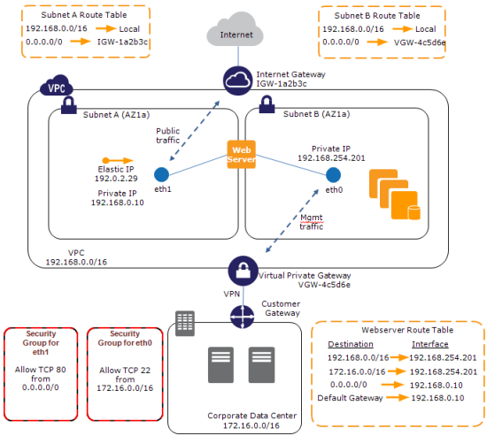
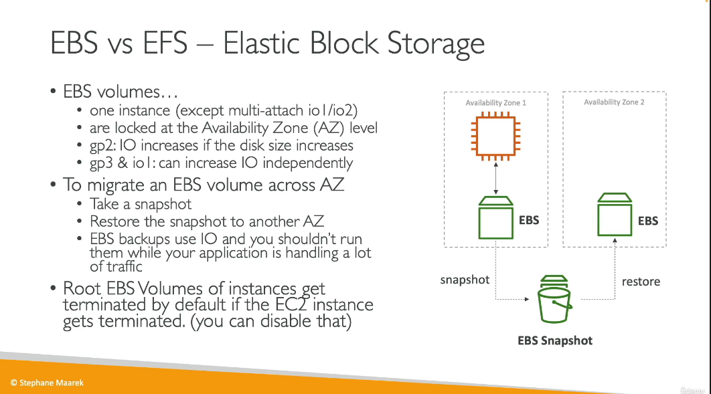
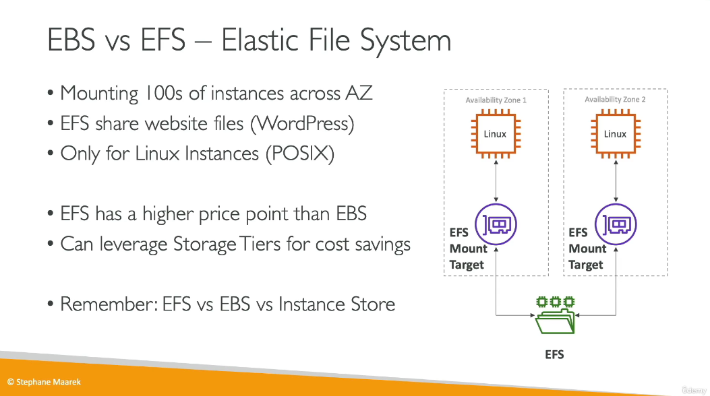
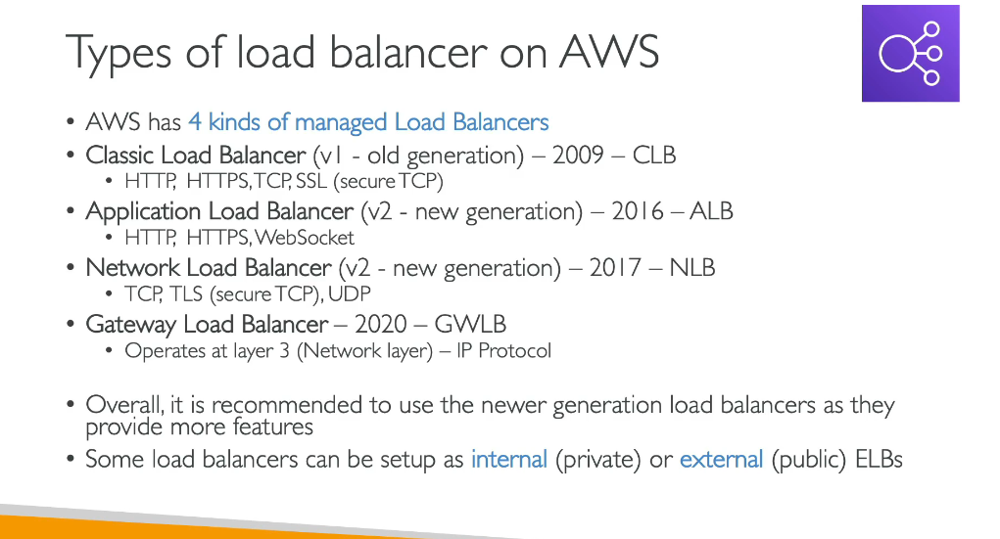
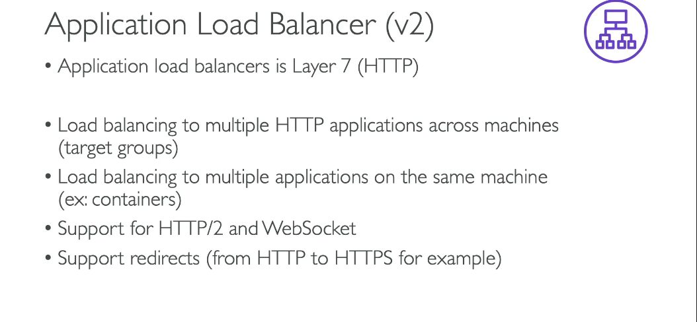
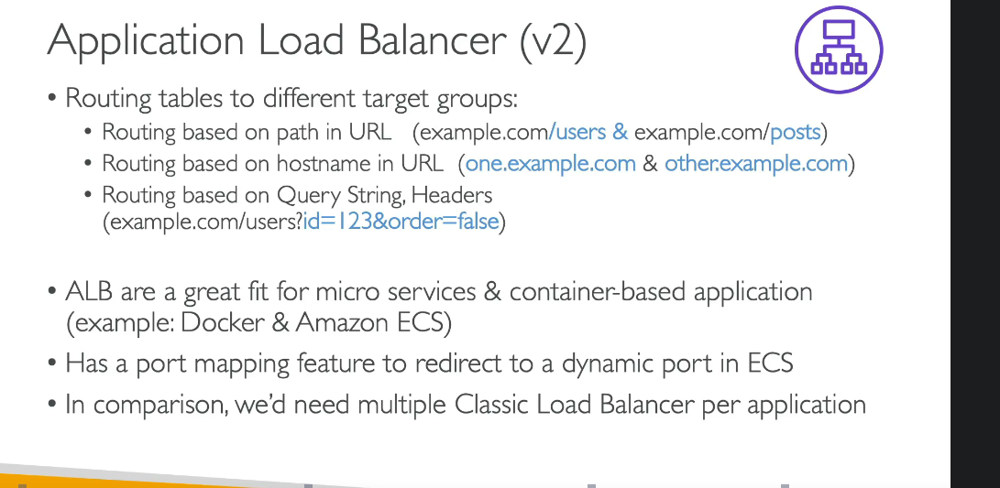
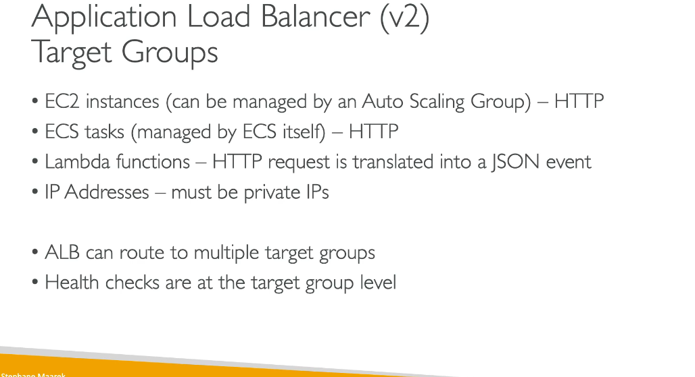
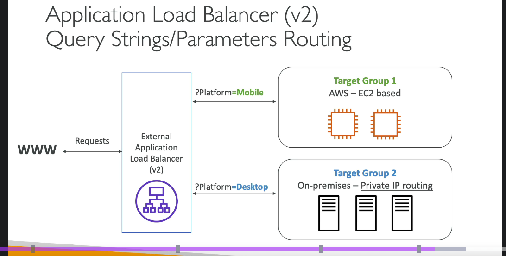

AWS:-
1-Regions - 39
2-AZ - 123
3-Data Centers
4-Edge Locations/ POP's

AWS has private networking that connect all the availability zones

AWS has many regions and each regiosn has many AZ with min 3 and max 6 , and each AZ is a seperate data center with its own netwokring , power and capabilites 

so they are not affected from disasters or issues related to one az 

and these az are connected using high bandwidth ultra low latency netwokring between all

AWS points of presence - edge locations which are used to deliver content to the end users , if we are servivng the data from a far away locatiosn these POP's helps us make sure that it will served to the end users with ultra low latency , they will cache these data and serve it (CDN)

IAM:-
- Identity and Access Management Acess
- The base account is root account , we shouldnt use or share it 
- we will create users and make it as groups 
- user can belong to multiple group
- Users and groups can be assigned JSON documents called policies 
- policies help us define the permissions of the users
- Least Privilege , only give access to those that is needed
- Multi session support
-- IAM Policy Structure
Version - policy language version - 2012-10-17
Id - policy identitying number (optional)
statements: one or more induvitual statements (req)
    sid - statment identifier (optional)
    Effect - Allow/Deny
    Principal - Account/user/role which this policy applied to
    Action- list of actions this policy allow or denies
    Resource - list of resources to which this policy applied to
    condition - condition for when this policy is in effect (optional)
--

administrator access
iam readonly access
---------------------------------

Placement groups - when we want to control over the EC2 instance placeemnt stratgey we should use placement groups , its like telling aws where we want to place our ec2 instances in regions ,

3 types:
 - Cluster - cluster instances into a low latency group in a single avaibaitty zone , great network bcoz of enhanced netwokring enabled with 10 gbps bandwidth between instances , if az fails all fails
 eg: big data jobs that needs to compleet very fast , app with ultra low latency

 - spread - spread intsnaces across underlying hardware (max 7 per group per AZ) - critical applications , can spa across az , reduced risk , ec2 instances are on different hardware , usescases:
    for apps needing max high avaibality and criticval apps where the instaces must be isolated from failue from each other

 - partition - spreads instances across many different partitions (whch rely on different sets of racks ) within a aAZ, scales to 100 of ec2 instances per group (hadoop , cassandra , kafka) , max 7 partions/ racks per az , each partiotns can hold many ec2 instances ,
 a partiton failure affects ec2 instances in that partiotn only 
 ec2 instances get access to partiton information as metadata
usecase sl HDFS , HBAse cassandra and kafka

--------------------
we have something called elastic network interface same as virtual network interface in azure , in aws its ENI

the eni has the following things
- one primary ipv4 private ip and one or more seconday ip
one elastic private ip 
one public ip
one or more secuirty group
one mac addresss

we can create it independelty and attach them on the fly on ec2 instaces fir failover , and its bound to a specific AZ

eni is associated wiht a subnet/az . 

Management Network / Backnet – You can create a dual-homed environment for your web, application, and database servers. The instance’s first ENI would be attached to a public subnet, routing 0.0.0.0/0 (all traffic) to the VPC’s Internet Gateway. The instance’s second ENI would be attached to a private subnet, with 0.0.0.0 routed to the VPN Gateway connected to your corporate network. You would use the private network for SSH access, management, logging, and so forth. You can apply different security groups to each ENI so that traffic port 80 is allowed through the first ENI, and traffic from the private subnet on port 22 is allowed through the second ENI.

Multi-Interface Applications – You can host load balancers, proxy servers, and NAT servers on an EC2 instance, carefully passing traffic from one subnet to the other. In this case you would clear the Source/Destination Check Flag to allow the instances to handle traffic that wasn’t addressed to them. We expect vendors of networking and security products to start building AMIs that make use of two ENIs.

MAC-Based Licensing – If you are running commercial software that is tied to a particular MAC address, you can license it against the MAC address of the ENI. Later, if you need to change instances or instance types, you can launch a replacement instance with the same ENI and MAC address.

Low-Budget High Availability – Attach a ENI to an instance; if the instance dies launch another one and attach the ENI to it. Traffic flow will resume within a few seconds.

-------------

ebs voluem  - elastic block store  is a netwirj druve you can attach to your instances while they run , 
it allows your unstances to persist data , even after their termination
they can only be mounted to one intsnace at a time (CCP Level)
they are bound to a sepcific AZ

"Network USB stick"
 - it uses network to commuincate the instances  , so there might be latency
- it can be detached from an ec2 and attach to another
- we cant attachs same ebs to 2 diff ec2 , but a single ec2 can have more thean one ebs
-
- its lovked to a AZ , to move a volume we need to snapshot it

- has a proviosned capcity in GBs and IOPS
you can increase the capcity
- we can leve it unattached also

- there is a delete on termination attribute which terminates when the intsnace is deleted , this is controllable

-  ebs volumes are bound to a sepcific AZ

- ebs snapshots are backups of your ebs volumes at any point in time
- it is recomended to dettach volume
- it is how we trasnfer a ebs volume from one az to another
- ebs snapshot archive - 75 percent cheaper , tkes 24 to 72 hr for restoring
- recycle bin for ebs snapshots - deleted snapshots will be here with retention policy , so we cn restore if neeeded
- fast snapshot restore - force full intizlation of snapshot to have no latency on first use , its costly

- its a way for disaster recover , we can copy a snapshot from one region to another 

- wiyh io1 /io2 family we can attach same ebs volume to upto 16 ec2 instances , it is a high throughput setup
- acheive hgiher avaibleity of application in a clustered env , mjts use a file ssytem that is cvluster aware

EFS - elastic file system - it a network file system , can be mounted on many ec2 , cheaper than ebs and is pay per use , 
use cases 0 contet management, wordpress, web serving, data sharing
- use NFS protocol
- to control access to EFS we need secuirty group
- can be use dwith linux AMI only 

EBS vs EFS

-------------------------------

AMI - Amazon Machine Image
they represent a customization of ec2 instance
- you add your own software  configuration , os , monitoring
- faster boot , 
- ami are built for specific regin

-----------------

Load balancers

Route 53

CloudFront - CDN

WAF

EC2

Elastic Beanstalk
 
Lambda

Rekognition
