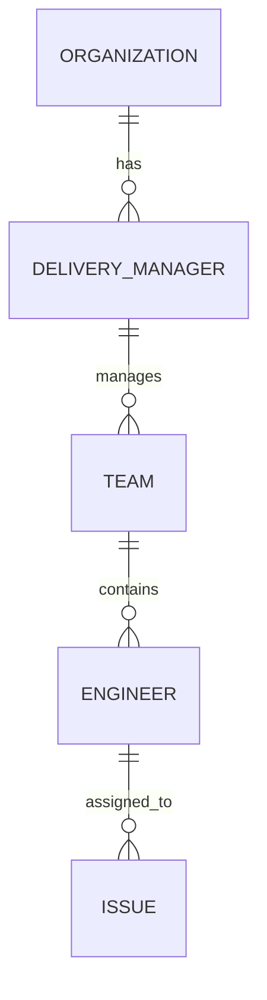
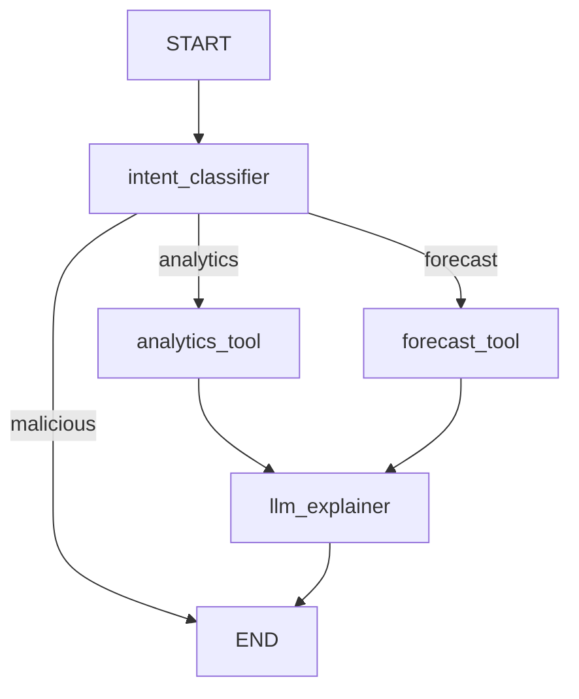
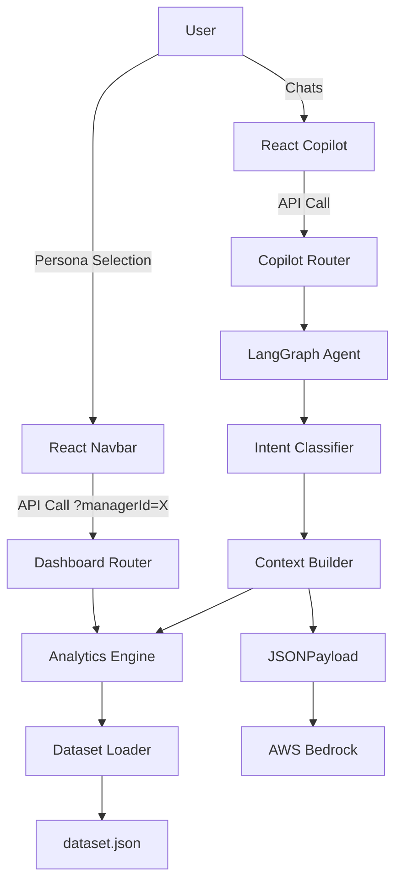

# CUIA COMPLETE SYSTEM UNDERSTANDING REPORT

## PART I — EXECUTIVE UNDERSTANDING

### 1. Executive Summary
CUIA (Capacity & Utilization Intelligence Agent) is a deterministic workforce analytics platform built as a Proof of Concept (POC). It extracts actionable intelligence from simulated Jira and HR data. The core philosophy of CUIA is **Architectural Determinism**: AI is used *only* as a natural language interface to explain metrics that are rigorously computed by Python services. 

### 2. What CUIA Is
CUIA is a full-stack application (React/Vite Frontend, FastAPI/Python Backend) that visualizes engineering capacity, utilization, and team health. It features an AI Copilot that allows users to ask natural language questions about their teams.

### 3. Problem
Engineering leaders struggle to synthesize data from Jira (issues/velocity) and HR (leave/capacity) to understand true team health and predict burnout.

### 4. Users
- **Leadership**: Can view org-wide metrics and all teams.
- **Delivery Managers**: Can view *only* the teams they manage.

### 5. Capabilities
- Deterministic calculation of Capacity, Utilization, and Productivity.
- Team health and burnout risk assessment.
- Skill gap and Single Point of Failure (SPOF) detection.
- Deterministic trend forecasting.
- Natural language querying via an AI Copilot.

### 6. POC Scope
**Implemented**: Full UI, FastAPI backend, LangGraph agent, Deterministic analytics engines, Mock Authentication (Persona switching).
**Not Implemented/Mocked**: Real PostgreSQL database (uses in-memory JSON), OAuth/SSO, live Jira Webhooks.

---

## PART II — REPOSITORY

### 7. Repository Structure
```text
CUIA/
├── frontend/
│   ├── src/
│   │   ├── components/ (Chat, Navbar, Sidebar)
│   │   ├── pages/ (DashboardController, TeamDetails, Copilot)
│   │   ├── services/ (api.ts)
│   │   └── types/ (index.ts)
│   ├── package.json
│   └── vite.config.ts
├── backend/
│   ├── app/
│   │   ├── ai/ (graph.py, intent_classifier.py, context_builders.py)
│   │   ├── api/ (dashboard.py, analytics.py, copilot.py)
│   │   ├── config/ (analytics_rules.json, business_rules.json)
│   │   ├── core/ (config_loader.py, data_validator.py)
│   │   ├── models/ (schemas.py)
│   │   └── services/ (analytics_engine.py, business_rules_engine.py, forecast_engine.py)
│   ├── sample_data/ (dataset.json)
│   └── requirements.txt
├── docker-compose.yml
└── Caddyfile
```

### 8. File-by-File Analysis
*(Covering major subsystems below)*

### 9. Important Files
1. `backend/app/services/analytics_engine.py`: The computational heart. Calculates utilization, capacity, and productivity.
2. `backend/app/ai/graph.py`: LangGraph implementation routing AI requests.
3. `backend/sample_data/dataset.json`: The "database" holding all engineers and issues.
4. `frontend/src/pages/DashboardController.tsx`: Routes traffic based on the active persona.

### 10. Dependencies
- **Frontend**: React, React Router, TailwindCSS, Recharts, Axios, Lucide React.
- **Backend**: FastAPI, Uvicorn, Pandas, Numpy, Pydantic, LangGraph, LangChain, Boto3 (AWS Bedrock).

---

## PART III — ARCHITECTURE

### 11. System Architecture
```mermaid
flowchart TD
    User --> Browser
    Browser --> Caddy Proxy
    Caddy Proxy --> React Frontend
    React Frontend --> FastAPI Backend
    FastAPI Backend --> AI Layer (LangGraph)
    AI Layer (LangGraph) --> AWS Bedrock
    FastAPI Backend --> Services Layer
    Services Layer --> DatasetLoader
    DatasetLoader --> dataset.json
```

### 12. Component Architecture
- **Presentation Layer**: React components handling state and routing.
- **API Layer**: FastAPI routers enforcing request/response schemas.
- **Service Layer**: Pure Python engines executing deterministic logic.
- **Data Layer**: In-memory JSON structures representing a database.

### 13. Runtime Architecture
Docker Compose orchestrates the frontend (Vite built), backend (Uvicorn), and a Caddy reverse proxy on port 80.

### 14. Dependency Graph
```text
DashboardController 
  ↓
api.ts
  ↓
dashboard.py (Router)
  ↓
AnalyticsEngine
  ↓
dataset.json
```

### 15. Docker Architecture
- `frontend`: Builds `frontend/Dockerfile`. Serves built React app.
- `backend`: Builds `backend/Dockerfile`. Runs Uvicorn server on port 8000.
- `caddy`: Alpine image. Proxies port 80 to `frontend:80` and `/api` to `backend:8000`.

---

## PART IV — FRONTEND

### 16. Frontend Architecture
React 18 SPA. Uses `react-router-dom` for navigation. Global state is minimal; `persona` is held in `App.tsx` and persisted to `localStorage`.

### 17. Routes
| Route | Page | Purpose |
|---|---|---|
| `/` | `DashboardController.tsx` | Main dashboard (varies by persona) |
| `/reports` | `Reports.tsx` | Download reports |
| `/copilot` | `Copilot.tsx` | Chat interface |
| `/team/:id` | `TeamDetails.tsx` | Team drilldown |
| `/engineer/:id` | `EngineerDetails.tsx` | Engineer drilldown |

### 18. Pages
Pages execute `useEffect` hooks calling `services/api.ts` to fetch data from the backend, then pass this data down to components (e.g., Recharts for graphs).

### 19. Components
`Navbar` handles the persona dropdown. `Sidebar` handles navigation. `Chat` handles the Copilot UI.

### 20. State
No Redux. `useState` is used locally inside pages to hold fetched data.

### 21. API Client
`frontend/src/services/api.ts` uses Axios with a base URL of `/api`.

---

## PART V — BACKEND

### 22. Backend Architecture
FastAPI application organized by domain (AI, API, Core, Models, Services).

### 23. Routers
`dashboard.py`, `analytics.py`, `copilot.py`, `simulation.py`, `forecast.py`. They act as thin wrappers over the Service layer.

### 24. Services
`AnalyticsEngine`, `BusinessRulesEngine`, `ForecastEngine`, `RecommendationEngine`. 
*Note: They heavily rely on class methods (`@classmethod`) and internal caching (`_analytics = None`).*

### 25. Schemas
Pydantic models in `schemas.py` (`Engineer`, `Issue`, `Team`, `ChatRequest`).

### 26. Models
Because there is no ORM (like SQLAlchemy), the Pydantic schemas serve as both validation models and the core internal models.

### 27. Repositories
There is no repository pattern. `DatasetLoader` loads `dataset.json` directly into the Pydantic schemas.

---

## PART VI — DATABASE

### 28. Database Architecture
**IMPLEMENTED AS MOCKED JSON.** No real relational database exists.

### 29. ER Diagram (Conceptual based on JSON structure)


### 30. Tables (JSON Arrays)
- `engineers`: Array of Engineer objects.
- `teams`: Array of Team objects.
- `issues`: Array of Jira issue objects.

### 31. Relationships
Relationships are maintained via string IDs. `Engineer.teamId -> Team.id`. `Issue.assignee -> Engineer.id`.

### 32. Data Lifecycle
`main.py` -> `lifespan` event -> `DatasetLoader.get_dataset()` reads the JSON file from disk into RAM exactly once.

---

## PART VII — SECURITY

### 33. Authentication
**MOCKED.** There is no real Auth. The user selects a persona in the frontend UI.

### 34. Authorization
**PARTIALLY VERIFIED.** Authorization is enforced by the backend accepting a `managerId` or `persona` parameter in the API route, and manually filtering the dataset in the router. (e.g., `teams = [t for t in analytics["teams"] if t["managerId"] == managerId]`).

### 35. RBAC
Roles: `leadership` (sees everything) and `dm-*` (Delivery Manager, sees only their teams).

### 36. Security Flow
```text
User changes dropdown -> LocalStorage updated -> Next API call sends ?managerId=dm-1 -> Backend router filters array -> Returns 200 OK.
```

---

## PART VIII — DATA

### 37. Data Sources
`backend/sample_data/dataset.json`.

### 38. Ingestion
File I/O read on FastAPI startup.

### 39. Validation
`DataValidator.validate(dataset)` runs on startup to ensure no missing critical fields.

### 40. Normalization
Handled by Pydantic loading the JSON into strongly typed Python objects.

### 41. Storage
In-memory Python objects.

### 42. Data Lineage
```text
dataset.json -> DatasetLoader -> Pydantic Models -> AnalyticsEngine -> FastAPI Router -> api.ts -> React State
```

---

## PART IX — ANALYTICS (Deep Reverse Engineering)

### 43. Analytics Architecture
`AnalyticsEngine._compute()` is the master orchestrator. It runs once on startup and caches the result.

### 44. Capacity
**Code**: `analytics_engine.py` -> `_compute_engineer_metrics`
**Formula**: `sprint_capacity = eng.effectiveCapacity * sprint_duration_weeks`
(Where `effectiveCapacity` is hardcoded in the JSON, accounting for leave).

### 45. Utilization
**Code**: `analytics_engine.py` -> `_compute_engineer_metrics`
**Formula**: `(logged_cs / sprint_capacity * 100) if sprint_capacity > 0 else 0.0`
**Explanation**: Divides total logged hours on current sprint issues by the calculated capacity.

### 46. Productivity
**Formula**: `productivity_score_cs = sum((i.storyPoints or 0) * priority_weights.get(i.priority, 1) for i in resolved_cs)`
**Explanation**: Story points completed, weighted by Jira priority.

### 47. Workload
Usually analogous to "Logged Hours" or "Active Tickets" in this system.

### 48. Jira Analytics
**Estimation Accuracy**: `100 - (abs(est_logged - est_original) / max(1, est_original) * 100)`
**Resolution Time**: Hours delta between `startedTime` and `resolvedTime`.

### 49. Skills & 50. Dependencies
**Code**: `dashboard.py` -> `_compute_team_skills`
If a skill is owned by only 1 person on a team, `Risk = "Critical"` (SPOF). 
It recommends cross-training for anyone on the team who has it listed as a `secondarySkill` and has `<80%` utilization.

### 51. Risks
Team Health Score combines util balance, productivity, velocity, minus penalties for critical/blocked tickets. Burnout risk triggers if utilization > 95% or 110% (configurable).

### 52. Team Analytics
Team metrics are mathematical averages (or sums) of the individual engineers comprising the team.

### 53. Engineer Analytics
Specific metrics scoped directly to the engineer's assigned issues.

---

## PART X — AI (Extremely Deep Analysis)

### 54. AI Architecture
LangGraph agent with a custom Intent Classifier to avoid LLM calls for routing.

### 55. Copilot
Endpoint: `POST /api/copilot/chat` -> Calls `graph.chat()`.

### 56. LangGraph


### 57. State
`AgentState(TypedDict)`: `question`, `persona`, `intent`, `entities`, `scoped_context`, `response`.

### 58. Nodes
- `intent_classifier`: Runs Regex entity extraction + Keyword scoring. (Does NOT call LLM unless keyword score is ambiguous).
- `llm_explainer`: Calls AWS Bedrock to format the context.

### 59. Tools
`analytics_tool`, `forecast_tool`, etc. 
**Crucial**: These are *not* LangChain agent tools. They are deterministic Python functions (nodes) that call `ContextBuilder` to fetch a compressed JSON string of the pre-computed analytics.

### 60. LLM
Provider: AWS Bedrock (`BedrockClient` in `bedrock_client.py`).

### 61. Prompt Flow
```text
System Prompt + Compressed JSON Context + User Question -> Bedrock -> String Response
```

### 62. AI Data Lineage
```text
AnalyticsEngine (Precomputed) -> ContextBuilder (Filters for specific Intent/Entities) -> JSON String -> LLM -> English Answer
```

### 63. AI vs Deterministic Logic
**Deterministic**: Capacity, Utilization, Forecasting, Team Health, Business Rules (who is the best performer).
**AI**: Only linguistic formatting of the deterministic JSON context.

---

## PART XI — END-TO-END FLOWS

### 64. Login
Mocked. Change dropdown in UI.

### 65. Dashboard
UI mounts -> API call `GET /dashboard/delivery?managerId=X` -> Router filters cached analytics for manager X -> JSON returned -> Recharts renders.

### 66. Teams
UI clicks team -> `GET /dashboard/team/{teamId}` -> Router filters cached analytics -> JSON returned.

### 67. Engineer
UI clicks engineer -> `GET /dashboard/engineer/{engId}` -> Router filters for engineer -> JSON returned.

### 68. Analytics
Computed ONCE on backend startup via `AnalyticsEngine.get_analytics()`.

### 69. Data Upload
Not implemented in POC.

### 70. Copilot
User types question -> POST API -> `intent_classifier` node -> `ContextBuilder` fetches data -> `llm_explainer` node queries AWS Bedrock -> Returns answer.

### 71. Error Paths
If Bedrock is down, `llm_explainer` returns "Error: AI service is not available." If UI receives 500, standard Axios error handling applies.

---

## PART XII — CODE TRACEABILITY

### 72. API Call Chains
`GET /api/dashboard/delivery` -> `app.api.dashboard.get_delivery_dashboard` -> `AnalyticsEngine.get_analytics()`

### 73. Function Call Chains
`classify_intent` -> `SynonymEngine.normalize` -> keyword matching -> Returns `(intent, score, needs_llm)`.

### 74. File Participation Maps
**Feature: Copilot** | `copilot.py` (API) | `graph.py` (LangGraph) | `intent_classifier.py` (Routing) | `context_builders.py` (Data gathering) | `bedrock_client.py` (LLM)

### 75. Data Transformations
`dataset.json` string -> `json.load()` dict -> `Dataset` Pydantic model -> `AnalyticsEngine` dict -> JSON response string -> Axios JS Object -> React Props.

### 76. Important Code Snippets
**Intent Classification (Avoiding LLM Calls):**
```python
# backend/app/ai/intent_classifier.py
if top_score - runner_up_score <= AMBIGUITY_MARGIN and runner_up_score > 0:
    return (top_intent, top_score, True) # True means needs LLM fallback
return (top_intent, top_score, False) # Fast, deterministic return
```

---

## PART XIII — POC AUDIT

### 77. Implemented
FastAPI Backend, React Frontend, LangGraph Agent, Deterministic Analytics.
### 78. Partially Implemented
Forecasting (Uses simple linear trend on historical sprint data, not real ML).
### 79. Mocked
Authentication, RBAC, Database (`dataset.json`).
### 80. Planned
PostgreSQL, Live Jira Webhooks, Real OAuth2.
### 81. Unused
No major dead code detected, codebase is quite lean.
### 82. Documentation Discrepancies
Documentation implies a real database and live ingestion; implementation uses in-memory JSON.
### 83. Risks
`AnalyticsEngine` loads everything into memory. If `dataset.json` becomes 10GB, the FastAPI server will OOM (Out of Memory) crash.
### 84. Technical Debt
No real repository layer. Lack of interface segregation between DB and Services.

---

## PART XIV — DEMO PREPARATION

### 85. Demo Story
"We built CUIA to bridge the gap between Jira data and actionable intelligence. We use deterministic math to calculate health, and AI only as a safe interface."

### 86. Demo Flow
1. Show Leadership Dashboard (Org view).
2. Switch Persona to Delivery Manager (RBAC in action).
3. Drill into a Team (Skills risk & Recommendations).
4. Ask Copilot a question (Explain the LangGraph architecture).

### 87. Click-by-Click Explanation
*Click: Copilot Submit*
React `chatWithCopilot` -> API `POST /copilot/chat` -> `CopilotGraph.chat()` -> `intent_classifier` Node -> `analytics_tool` Node -> `llm_explainer` Node -> Bedrock -> Result displayed.

### 88. Talk Track
"Notice how fast the Copilot responded. We don't use LLMs for routing. We use a weighted keyword intent classifier. The LLM is only invoked at the very end to format a pre-computed JSON string."

### 89. Likely Questions & 90. Answers
**Q: How does the AI calculate utilization?**
**A**: It doesn't. `AnalyticsEngine.py` calculates it deterministically (`Logged / Capacity`). The AI simply reads a JSON payload containing the final number.

---

## PART XV — MASTER CHEAT SHEET

### 91. Architecture Cheat Sheet
Frontend: React/Vite. Backend: FastAPI. AI: LangGraph/Bedrock. DB: JSON. Auth: Mocked UI State.

### 92. API Cheat Sheet
`GET /api/dashboard/leadership`, `GET /api/dashboard/delivery?managerId=X`, `POST /api/copilot/chat`.

### 93. File Cheat Sheet
`graph.py` (AI), `analytics_engine.py` (Math), `dashboard.py` (API Routers).

### 94. Function Cheat Sheet
`_compute_engineer_metrics` (Calculates base metrics). `classify_intent` (AI routing).

### 95. Formula Cheat Sheet
Util = Logged / Cap. Prod = StoryPoints * PriorityWeight. Cap = EffectiveCap * SprintWeeks.

### 96. AI Cheat Sheet
Graph Flow: Intent -> Tool -> LLM Explainer.

### 97. Database Cheat Sheet
Mocked via `dataset.json`.

---

## PART XVI — FINAL UNDERSTANDING

### 98. 30-Second Explanation
"CUIA is a deterministic analytics platform. It calculates team health and capacity using strict Python math on Jira data. It features a LangGraph AI Copilot that acts purely as a natural language interface to explain those calculations, ensuring zero hallucinations."

### 99. 5-Minute Explanation
(Use the Demo Story + Architecture breakdown in Section 86 and 88).

### 100. One-Hour Learning Path
1. `main.py` (How app starts and loads data)
2. `analytics_engine.py` (Understand the math)
3. `graph.py` & `intent_classifier.py` (Understand how LangGraph saves tokens)
4. `dashboard.py` (Understand how APIs scope data by persona)
5. `App.tsx` & `Navbar.tsx` (Understand mocked Auth)

### 101. Final Master Architecture Diagram

