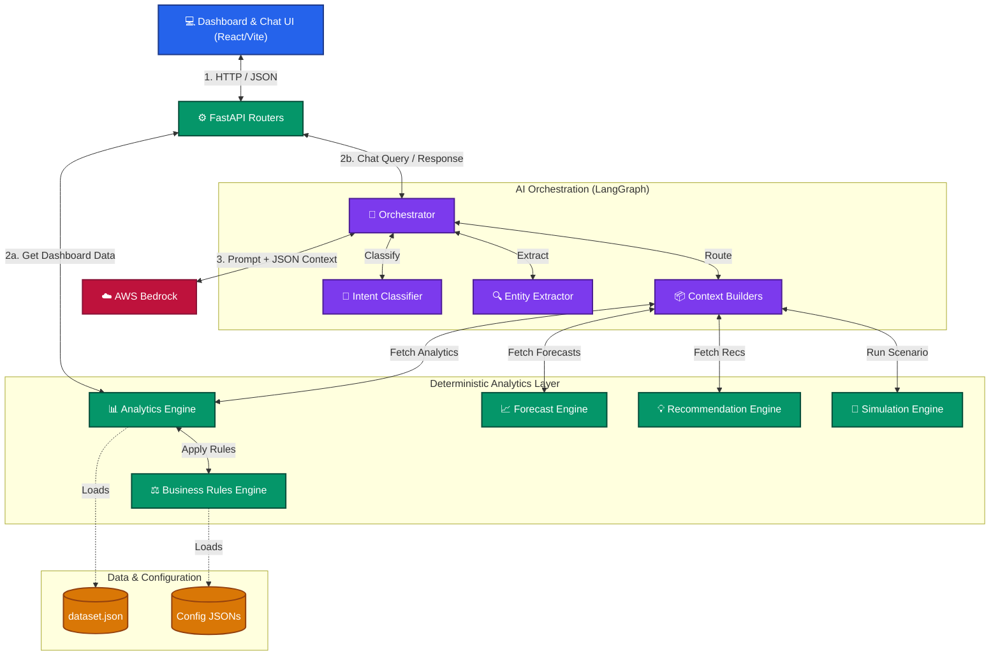

# 2. System Architecture

CUIA is built on a strict "deterministic-first" architecture. The business logic lives entirely in standard Python code, ensuring metrics are 100% reproducible and explainable. AI is used solely as a presentation layer.

## Master Architecture Diagram

## Core Subsystems

### 1. Frontend (React)
- **Responsibility:** Provides the UI for Dashboards (Leadership and DM) and the AI Copilot chat interface.
- **Key Files:** `src/pages/LeadershipDashboard.tsx`, `src/pages/DeliveryDashboard.tsx`, `src/pages/Copilot.tsx`

### 2. FastAPI API Layer
- **Responsibility:** Handles HTTP requests, enforces initial routing, and acts as the bridge to backend services.
- **Key Files:** `app/main.py`, `app/api/dashboard.py`, `app/api/copilot.py`

### 3. Deterministic Analytics Layer
- **Responsibility:** The computational heart of CUIA. Computes all metrics (utilization, health, velocity) from raw data. **Never uses AI.**
- **Key Files:** `app/services/analytics_engine.py`, `app/services/business_rules_engine.py`

### 4. AI Orchestration Layer (LangGraph)
- **Responsibility:** Processes natural language questions. It uses deterministic intent classification and entity extraction to figure out what the user wants. It then builds a narrow context payload from the Analytics Layer and sends it to the LLM for explanation.
- **Key Files:** `app/ai/graph.py`, `app/ai/intent_classifier.py`, `app/ai/entity_extractor.py`, `app/ai/context_builders.py`

### 5. AWS Bedrock (LLM)
- **Responsibility:** Generates human-readable explanations based *strictly* on the injected JSON context.
- **Key Files:** `app/ai/bedrock_client.py`

### 6. Data & Configuration Layer
- **Responsibility:** Loads and caches the simulated Jira dataset and JSON-based business rules.
- **Key Files:** `app/services/dataset_loader.py`, `app/core/config_loader.py`
