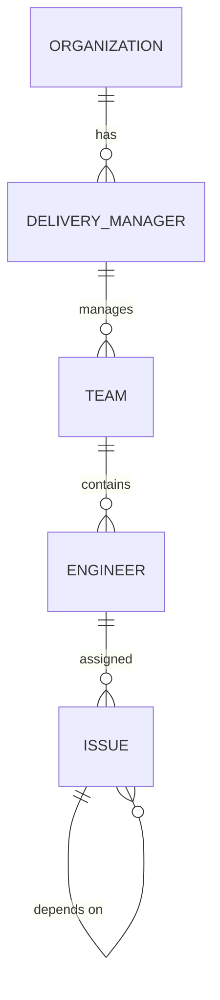

# 4. Data Model and Data Flow

CUIA relies on a static JSON dataset representing an extract from a system of record like Jira or Workday. The `DatasetLoader` validates this payload on startup to ensure strict typing.

## Entity Relationships

The data model is hierarchical and strictly relational:
- **Organization** contains **Delivery Managers**
- **Delivery Managers** manage **Teams**
- **Teams** consist of **Engineers**
- **Engineers** are assigned **Issues**



## Schema Definitions (Pydantic)

The schemas are defined in `app/models/schemas.py`.

### Issue
Represents a unit of work (ticket, story, bug).
- `issueKey` (str): Unique ID (e.g., "PROJ-101")
- `priority` (str): Low, Medium, High, Critical
- `storyPoints` (int): Agile estimation points
- `loggedHours` (float): Actual hours logged
- `status` (str): e.g., "In Progress", "Done", "Blocked"
- `assignee` (str): Matches Engineer `id`
- `sprint` (str): Sprint identifier (e.g., "Sprint 42")

### Engineer
Represents a team member.
- `id` (str): Unique ID
- `teamId` (str): Matches Team `id`
- `effectiveCapacity` (float): Base available hours per week minus standard deductions (e.g., 32.0). **This is the denominator for utilization.**
- `primarySkills` (List[str]): Core proficiencies used for SPOF (Single Point of Failure) detection.

### Team
Represents a group of engineers.
- `id` (str): Unique ID
- `managerId` (str): Matches DeliveryManager `id`

## Data Flow Principles

1. **Static Load:** `dataset.json` is loaded exactly once on startup via `DatasetLoader`.
2. **Immutable Source:** The raw dataset is never mutated by the backend.
3. **Pre-computation:** The `AnalyticsEngine` computes all operational metrics on startup and caches the result dictionary.
4. **No LLM Data Ownership:** Raw dataset rows are *never* sent to the LLM indiscriminately. The LLM only receives tightly scoped, pre-computed JSON metrics generated by the Context Builders.

### The Canonical Data Flow Pipeline

```text
dataset.json
      ↓
DatasetLoader (Validates Pydantic schemas)
      ↓
AnalyticsEngine (Computes Utilization, Health, etc.)
      ↓
(API Requests)
      ↓
Dashboard APIs (Filtered by Persona)
      ↓
React Frontend
```
