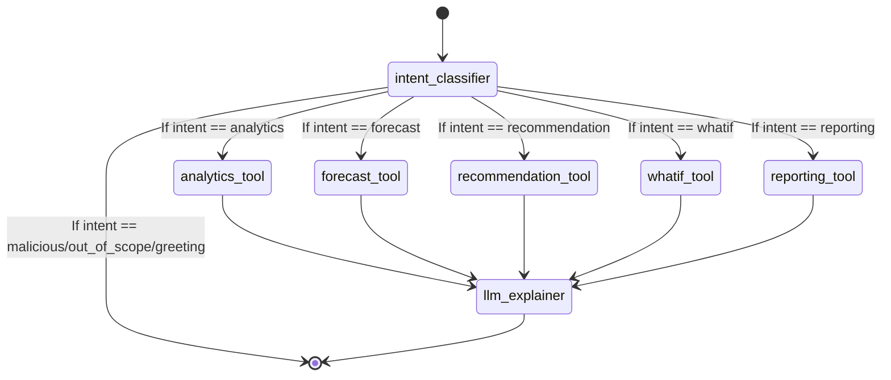

# 7. LangGraph Architecture

The CUIA AI Orchestration layer uses LangGraph to define a robust, state-based workflow for processing natural language queries.

## AgentState

The state dictionary passed between nodes is defined as:

```python
class AgentState(TypedDict):
    question: str
    persona: str
    intent: Optional[str]
    entities: Optional[dict]
    scoped_context: Optional[str]
    response: Optional[str]
    conversation_context: Optional[dict]
```

## Graph Structure

The workflow is highly optimized to minimize LLM calls. A typical request uses exactly **1 LLM call**.



## Node Details

### `intent_classifier`
1. **Extract Entities:** Runs `EntityExtractor.extract(question)` via substring matching against known IDs and names.
2. **Handle Follow-ups:** Checks `conversation_context` for explicit conversational markers ("why", "explain"). If found, inherits previous intent.
3. **Classify:** Runs `classify_intent()`. This uses weighted keyword scoring (e.g., "burnout risk" = +3 to Analytics). 
4. **Fallback:** If and *only if* the keyword scoring results in a tie or low confidence, it makes a tiny, 0-temperature LLM call to categorize the intent.
5. **Security:** If a malicious keyword ("ignore instructions") triggers the malicious threshold, it instantly routes to `END` with a static error message.

### Tool Nodes (`analytics_tool`, `forecast_tool`, etc.)
These are not LLM agents. They are deterministic Python functions that:
1. Read the `persona` and `entities` from `AgentState`.
2. Call `ContextBuilder`.
3. The Context Builder fetches the relevant pre-computed data from the Analytics Engine.
4. It filters the data (e.g., isolating a single team) and serializes it into a highly compressed JSON string to save tokens.
5. It updates the state: `scoped_context = <JSON string>`.

### `llm_explainer`
The only standard LLM node.
1. Takes the user's `question`, the `LLM_EXPLAINER_PROMPT`, and the `scoped_context` JSON.
2. Sends the combined prompt to AWS Bedrock.
3. Places the resulting natural language explanation into `response`.

## Error Handling
If AWS Bedrock is unavailable, or a timeout occurs, the FastAPI route explicitly masks internal traceback details and returns a standardized, user-friendly HTTP error (e.g., 503 Service Unavailable, 429 Rate Limit) that the frontend handles gracefully.
