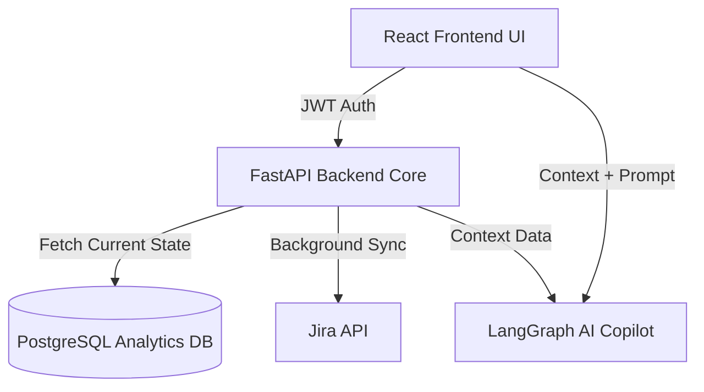

# CUIA Technical Design Document (TDD)
**Status:** Frozen | **Version:** 1.0.0

## Executive Summary
This Technical Design Document serves as the definitive blueprint for the remainder of the Capacity & Utilization Intelligence Agent (CUIA) Proof of Concept (POC) implementation. With backend analytics stabilized and the recommendation engine redesigned, this document rationalizes the KPIs, finalizes dashboard layouts, specifies the deterministic recommendation engine, outlines the forecasting algorithm, and formalizes the security boundaries. This TDD is the single source of truth; no implementation should deviate from these specifications.

## 1. Complete Data Dictionary
Comprehensive mapping of all data fields used across the system.

| Field Name | Data Type | Source | Description | Example Value | Used By | API Exposure | Dashboard | Recommendation | Forecast | AI Copilot |
|---|---|---|---|---|---|---|---|---|---|---|
| `employeeId` | UUID | Identity/Jira | Unique identifier for an engineer | `emp-8a2f1` | Auth, Aggregation | Private | Engineer | Yes (Skill map) | No | Yes (Role restrict) |
| `effectiveCapacity` | Integer | Calculated | Weekly available engineering hours after leave/meetings | `32` | Utilization, Risk | `/api/metrics/capacity` | DM, Lead, Eng | Yes | Yes | Yes |
| `totalDemand` | Integer | Jira | Total hours/points assigned in sprint | `40` | Gap, Forecast | `/api/metrics/demand` | DM, Team | Yes | Yes | Yes |
| `primarySkill` | String | HRIS | Main technical competency | `Backend (Python)` | Cross-training | `/api/skills` | Team | Yes | No | Yes |
| `secondarySkills` | Array[String] | HRIS | Alternative technical competencies | `['React', 'AWS']`| Cross-training | `/api/skills` | Team | Yes | No | Yes |
| `burnoutRiskScore` | Float (0-1) | Calculated | Probability of burnout based on >95% util over 3 sprints | `0.85` | Recommendations | `/api/metrics/risk` | DM | Yes | No | Yes |
| `velocity` | Integer | Jira | Average completed story points per sprint | `45` | Forecast | `/api/metrics/velocity` | Team | No | Yes | Yes |
| `ptoHours` | Integer | HRIS/Jira | Planned Time Off for current/future sprint | `8` | Capacity | `/api/metrics/pto` | Team | Yes | Yes | Yes |

## 2. Analytics Catalogue
Documentation of every metric calculated by the backend.

### 2.1 Utilization
*   **Purpose:** Measure how much capacity is actively consumed by demand.
*   **Formula:** `(totalDemand / effectiveCapacity) * 100`
*   **Reporting Window:** Current Sprint, 4-Sprint Trailing Average
*   **Required Inputs:** `totalDemand`, `effectiveCapacity`
*   **Output Range:** 0% - 150%+
*   **Business Meaning:** Indicates workload balance. Optimal is 80-85%.
*   **Thresholds:** Warning >90%, Critical >100%, Underutilized <60%
*   **Recommendation Dependencies:** Burnout Alert, Capacity Reallocation
*   **Charts using it:** Capacity vs Utilization (Line), Team Health
*   **APIs exposing it:** `/api/v1/analytics/utilization`

### 2.2 Burnout Risk
*   **Purpose:** Identify engineers consistently overworked.
*   **Formula:** If trailing 3 sprint utilization > 95% = HIGH. If trailing 2 > 95% = MEDIUM.
*   **Reporting Window:** Trailing 3 Sprints
*   **Required Inputs:** Historical `Utilization` by `employeeId`
*   **Output Range:** Low, Medium, High
*   **Business Meaning:** Highlights human risk factors before attrition occurs.
*   **Thresholds:** High triggers immediate recommendation alert.
*   **Recommendation Dependencies:** Load balancing recommendations.
*   **Charts using it:** Team Health Radar
*   **APIs exposing it:** `/api/v1/analytics/risk`

### 2.3 Capacity Gap
*   **Purpose:** Determine if the team can deliver the committed backlog.
*   **Formula:** `totalDemand - effectiveCapacity`
*   **Reporting Window:** Current Sprint
*   **Required Inputs:** `totalDemand`, `effectiveCapacity`
*   **Output Range:** Integer (positive = shortfall, negative = surplus)
*   **Business Meaning:** Direct indicator of sprint feasibility.
*   **Thresholds:** >0 triggers "Sprint at Risk".
*   **Recommendation Dependencies:** Scope reduction, resource borrowing.
*   **Charts using it:** Capacity vs Demand (Bar)
*   **APIs exposing it:** `/api/v1/analytics/capacity-gap`

## 3. Dashboard Specification
### 3.1 Delivery Dashboard (Main)
*   **Team Health Overview:** 
    *   *Purpose:* Quick RAG status check. *User:* DM. *Source:* `/api/health`. *Action:* Keep.
*   **Capacity vs Utilization Trend:** 
    *   *Purpose:* Track balance over time. *User:* DM. *Source:* `/api/utilization-trend`. *Action:* Modify (Reintroduce line graph layout).
*   **Active Recommendations:** 
    *   *Purpose:* Actionable insights. *User:* DM. *Source:* `/api/recommendations`. *Action:* Modify (Enforce deterministic data).

### 3.2 Team Dashboard
*   **Skills Coverage Matrix:** 
    *   *Purpose:* Identify bottlenecks. *User:* DM/Lead. *Source:* `/api/skills`. *Action:* Modify (Use new deterministic algorithm).
*   **Sprint Capacity Gap:** 
    *   *Purpose:* Manage current sprint risk. *User:* DM/Lead. *Source:* `/api/capacity-gap`. *Action:* Keep.

### 3.3 Engineer Dashboard
*   **Personal Utilization:** 
    *   *Purpose:* Self-management. *User:* Engineer. *Source:* `/api/my-utilization`. *Action:* Keep.

### 3.4 Leadership Dashboard (Planned)
*   **Org-wide Capacity Heatmap:** 
    *   *Purpose:* Macro allocation. *User:* Exec. *Source:* `/api/org/capacity`. *Action:* Build new.

## 4. KPI Rationalization
**Audit Outcome:**
*   **Retain (Main Dashboard):** Team Utilization %, Capacity Gap (Hours), Burnout Risk Count.
*   **Move to Drill-down:** Historical Velocity, Raw Story Points, Task Completion Times.
*   **Deprecate/Remove:** Individual "Tasks Completed" (focus on points/hours), Lines of Code.
*   **Conclusion:** The main dashboard will prioritize clarity by only showing actionable constraints (Utilization, Gap, Risk).

## 5. Visualization Strategy
*   **Capacity vs Utilization:** Line Graph mapping Effective Capacity vs Consumed Utilization over the last 6 sprints. Highly operational for spotting trends. Reintroduced to replace clustered bars.
*   **Jira Status Distribution:** Donut chart for Current Sprint snapshot.
*   **Team Health:** Radar Chart tracking 5 axes (Util, Quality, Velocity, Happiness, Risk).
*   **Forecast:** Area chart with a shaded "Cone of Uncertainty" based on confidence intervals.

## 6. Recommendation Engine Specification
All recommendations are completely deterministic and rely only on current analytics.

**Rule 1: High Burnout Risk Alert**
*   **Trigger Metric:** Engineer Utilization > 95% for >= 2 consecutive sprints.
*   **Severity:** Critical
*   **Suggested Action:** Reassign 20% of current sprint tasks to team member with lowest utilization (< 75%).
*   **Expected Outcome:** Utilization drops to < 85%.
*   **Confidence:** High

**Rule 2: Scope Overload**
*   **Trigger Metric:** Capacity Gap > 10% of total Capacity.
*   **Severity:** High
*   **Suggested Action:** Move lowest priority stories (by Jira rank) equivalent to gap size to next sprint.
*   **Expected Outcome:** Capacity Gap <= 0.
*   **Confidence:** High

## 7. Skills & Dependency Strategy
**Deterministic Algorithm for Cross-Training:**
1. Identify primary skill bottlenecks (Sprint Demand for Skill > Capacity for Skill).
2. Query engineers on the team with the bottlenecked skill as a `secondarySkill`.
3. Filter out engineers with `Current Sprint Utilization > 80%`.
4. Rank remaining candidates by `Skill Level` (Highest to Lowest).
5. Output top 2 candidates as recommended cross-training/pairing resources.

## 8. Forecast Design
**Algorithm:**
*   **Inputs:** Last 3 completed sprints (Velocity, Effective Capacity, PTO hours), Upcoming planned PTO.
*   **Formula:** `Forecast_Capacity = Avg(Cap_1, Cap_2, Cap_3) - Planned_PTO`
*   **Formula:** `Forecast_Velocity = Avg(Vel_1, Vel_2, Vel_3)`
*   **Confidence Calculation:** Inversely proportional to standard deviation of last 3 sprints' velocity. High variance = wider cone of uncertainty.
*   **Limitations:** Assumes stable team composition; cannot predict unlogged emergency leave.

## 9. Reporting Module Design
**Architecture:** PDF generation via Python/Jinja2 templates (using tools like `pdfkit` or `WeasyPrint`).
*   **Executive Report:** 1-page summary, Org-wide Utilization RAG status.
*   **Delivery Manager Report:** Multi-page. Sprint summaries, Burnout risks, Action items.
*   **Workflow:** UI Request -> API fetches JSON analytics -> Python binds to Jinja2 HTML -> Converts to PDF -> Streams Response.

## 10. AI Copilot Architecture
**Security & Boundaries:**
*   **Strict Isolation:** Copilot **never** calculates metrics. It only explains the deterministic backend JSON payloads.
*   **Context Construction:** 
    ```json
    { "context": { "utilization": 92, "at_risk": ["emp-123"] }, "question": "Who is at risk?" }
    ```
*   **Guardrails:** Pre-flight checks on user prompts. Post-flight validation of LLM output.
*   **Hallucination Prevention:** System prompt strictly instructs the LLM to reply "I do not have data to answer this" if the answer is not in the JSON context.

## 11. Security Architecture
*   **Authentication:** JWT (JSON Web Tokens).
*   **Authorization (RBAC):** Scopes: `admin`, `manager`, `engineer`.
*   **Manager Isolation:** API enforces `user.role == 'manager'` and `requested_team_id in user.managed_teams`.
*   **Engineer Isolation:** Can only access `/api/v1/engineers/me` and `/api/v1/teams/{my_team}/aggregated`.
*   **Rate Limiting:** General API: 100 req/min. AI Copilot API: 10 req/min.
*   **Secrets:** Managed via `.env` / environment variables. Never committed.

## 12. Architecture Diagrams


## 13. Implementation Roadmap
*   **Phase A – Security Foundation (Priority: High)**
    *   Implement JWT Authentication, RBAC, API Isolation, Rate Limiting.
*   **Phase B – Analytics & Dashboard Refinement (Priority: High)**
    *   Rationalize KPIs, reintroduce Capacity vs Util line graph, implement Delivery Manager main dashboard layout.
*   **Phase C – Deterministic Engines (Priority: Medium)**
    *   Implement deterministic Recommendation Engine and new Skills Cross-Training algorithm.
*   **Phase D – Forecasting & Reporting (Priority: Medium)**
    *   Implement rolling forecast algorithms and PDF generation workflows.
*   **Phase E – AI Copilot Hardening (Priority: High)**
    *   Enforce context isolation, prompt security, and guardrails to prevent calculation by LLM.
*   **Phase F – Leadership Dashboard (Priority: Low)**
    *   Build out executive KPIs and org-wide analytics views.
